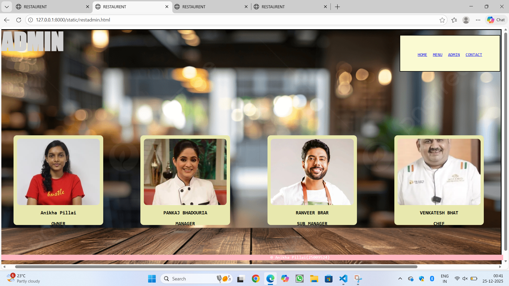
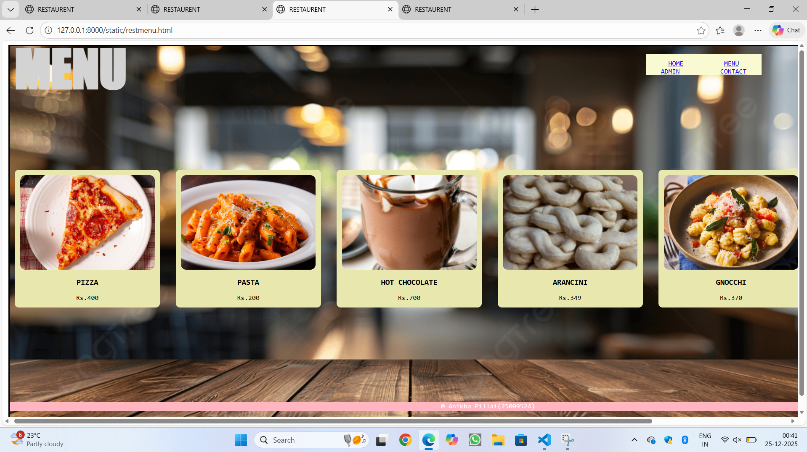
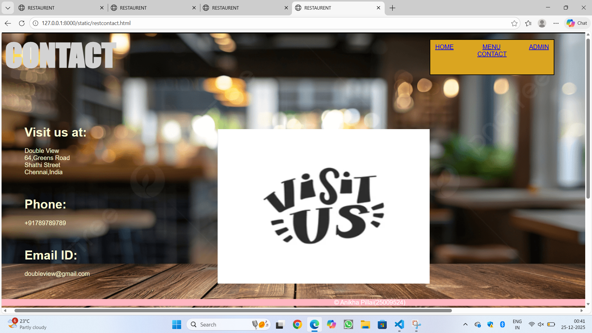

# Ex.06 Restaurant Website
## Date:

## AIM:
To develop a static Restaurant website to display the food items and services provided by them.

## DESIGN STEPS:

### Step 1:
Requirement collection.

### Step 2:
Creating the layout using HTML and CSS.

### Step 3:
Updating the sample content.

### Step 4:
Choose the appropriate style and color scheme.

### Step 5:
Validate the layout in various browsers.

### Step 6:
Validate the HTML code.

### Step 7:
Publish the website in the given URL.

## PROGRAM:
restfront.html
```
<html>
    <head>
        <title>RESTAURENT</title>
        <link rel="stylesheet" href="restfront.css">
    </head>
    <body>
        <div class="container">
            <div class="tab">
                <a href="restfront.html">HOME</a>
                <a href="restmenu.html">MENU</a>
                <a href="restadmij.html">ADMIN</a>
                <a href="restcontact.html">CONTACT</a> 
            </div>
            <div class="name">
                <h1>DOUBLE VIEW</h1>
            </div>
            <div class="quote">
                "FEEL THE TASTE"
            </div>
            <div class="quote1">
                "Try every species in your buds"
            </div>
            <div class="img1">
                
            </div>
            <footer class="copyrights">
                &copy; Anikha Pillai(25009524)
            </footer>
        </div>
    </body>
</html>

```
restfront.css
```
.container
{
    background-image: url(restimage1.png) ;
    height: 700px;
    width: 1500px;
    background-repeat: no-repeat;
    padding: 10px;
    padding-right: 5px;
    background-size: cover;
    border: 3px solid black ;
    margin-left: 10px;
    margin-right: 10px;
    font-family:sans-serif;
}
.tab 
{
    width: 200px;
    height: 7px;
    border: 2px solid rgb(251, 228, 228);
    padding: 50px;
    word-spacing: 70px;
    background-color: lightgoldenrodyellow;
    text-align: center;
    top: 1px;
    left: 1100px;
    position: relative;
   
}
.name
{
    color : lightgray;
    font-family:'Times New Roman';
    position: relative;
    font-size: 300%;
    top: -190px;
}
.quote
{
    color: darkolivegreen;
    font-size: 180%;    
    top: -150px;
    position: relative;
    text-align: center;
    font-family: 'Franklin Gothic Medium';
}
.quote1
{
  color: darkolivegreen;
    font-size: 250%;
    top: -150px;
    position: relative;
    text-align: center; 
    font-family:'Lucida Sans'; 
}
.img1
{
    position: relative;
    top: -100px;
    left: 550px;
}
.copyrights
{
    width: 1820px;
    height: 17px;
    background-color:lightpink;
    position: relative;
    text-align: center;
    color: antiquewhite;
    top: 50px;
    right: 10px;
}

```
restmenu.html
```
<html>
    <head>
        <title>RESTAURENT</title>
        <link rel="stylesheet" href="restmenu.css">
    </head>
    <body>
        <div class="container">
            <div class="tab">
                <a href="restfront.html">HOME</a>
                <a href="restmenu.html">MENU</a>
                <a href="restadmin.html">ADMIN</a>
                <a href="restcontact.html">CONTACT</a> 
            </div>
            <div class="name">
                <h1>MENU</h1>
            </div >
            <div class="menu">
                <div class="item">
                    
                    <h1>PIZZA</h1>
                    <p>Rs.400</p>
                </div>
                <div class="item">
                    
                    <h1>PASTA</h1>
                    <p>Rs.200</p>
                </div>
                <div class="item">
                    
                    <h1>HOT CHOCOLATE</h1>
                    <p>Rs.700</p>
                </div>
                <div class="item">
                    
                    <h1>ARANCINI</h1>
                    <p>Rs.349</p>
                </div>
                <div class="item">
                    
                    <h1>GNOCCHI</h1>
                    <p>Rs.370</p>
                </div>
                
                
            </div>
            <footer class="copyrights">
                &copy; Anikha Pillai(25009524)
            </footer>
        </div>
    </body>
</html>

```
restmenu.css
```
.container
{
    background-image: url(restimage1.png) ;
    height: 700px;
    width: 1500px;
    background-repeat: no-repeat;
    padding: 10px;
    padding-right: 5px;
    background-size: cover;
    border: 3px solid black ;
    margin-left: 10px;
    margin-right: 10px;
    font-family:monospace;
}

.tab 
{
    width: 200px;
    height: 20px;
    padding: 10px;
    word-spacing: 70px;
    background-color: lightgoldenrodyellow;
    text-align: center;
    top: 5px;
    left: 1200px;
    position: relative;
   
}

.name 
{
    color: lightgray;
    font-family: fantasy;
    text-align: left;
    position: relative;
    font-size: 300%;
    top: -130px;
}

.menu 
{
    display: grid;
    grid-template-columns: repeat(auto-fit, minmax(50px, 1fr));;
    gap: 50px;
    justify-items: center;
    padding: 10px;
    margin-top: -70px;
}

.item {
    background-color: rgb(232, 232, 174);
    border-radius: 8px;
    text-align: center;
    padding: 10px;
    width: 100%;
}

.item img {
    border-radius: 10px;
    width: 100%;
    height: 180px;
    object-fit: cover;
}

.item h1 {
    font-size: 15px;
    color: black;
    margin-top: 15px;
}

.item p {
    color: black;
    margin-bottom: 1px;
}

.copyrights
{
    width: 1820px;
    height: 17px;
    background-color: lightpink;
    position: relative;
    text-align: center;
    color: white;
    top: 170px;
    right: 10px;
}

```
restadmin.html
```
<html>
    <head>
        <title>RESTAURENT</title>
        <link rel="stylesheet" href="restadmin.css">
    </head>
    <body>
        <div class="container">
            <div class="tab">
                <a href="restfront.html">HOME</a>
                <a href="restmenu.html">MENU</a>
                <a href="restadmin.html">ADMIN</a>
                <a href="restcontact.html">CONTACT</a> 
            </div>
            <div class="name">
            <h2>ADMIN</h2>
            </div>
            <div class="admin">
                <div class="admin1">
                
                <h1>Anikha Pillai</h1>
                <h3>OWNER</h3>
                </div>
                <div class="admin1">
                
                <h1>PANKAJ BHADOURIA</h1>
                <h3>MANAGER</h3>
                </div>
                <div class="admin1">
                
                <h1>RANVEER BRAR</h1>
                <h3>SUB MANAGER</h3>
                </div>
                <div class="admin1">
                
                <h1>VENKATESH BHAT</h1>
                <h3>CHEF</h3>
                </div>
            </div>
            <footer class="copyrights">
            &copy; Anikha Pillai(25009524)
            </footer>
        </div>
    </body>
</html>

```
restadmin.css
```
.container
{
    background-image: url(restimage1.png) ;
    height: 700px;
    width: 1500px;
    background-repeat: no-repeat;
    padding: 10px;
    padding-right: 5px;
    background-size: cover;
    border: 3px solid black ;
    margin-left: 10px;
    margin-right: 10px;
    font-family:monospace;
}

.tab 
{
    width: 200px;
    height: 7px;
    border: 2px solid black;
    padding: 50px;
    word-spacing: 10px;
    background-color: lightgoldenrodyellow;
    text-align: center;
    top: 5px;
    left: 1200px;
    position: relative;
    font: Arial;
   
}

.name 
{
    color: lightgray;
    font-family: fantasy;
    text-align: left;
    position: relative;
    font-size: 300%;
    top: -190px;
}

.admin
{
    display: grid;
    grid-template-columns: repeat(auto-fit, minmax(50px, 1fr));;
    gap: 50px;
    justify-items: center;
    padding: 10px;
    margin-top: -70px;
}
.admin1
{
    background-color: rgb(232, 232, 174);
    border-radius: 10px;
    text-align: center;
    padding: 10px;
    width: 250px;
     margin-top: 50px;
    height: 250px;
    margin-right: 10px;
}

.admin1 img 
{
    border-radius: 10px;
    width: 100%;
    height: 200px;
    object-fit: cover;
    border-radius: 10px;
}

.admin1 h1 
{
    font-size: 15px;
    color: black;
    margin-top: 15px;
}

.admin1 p
 {
    color: black;
    margin-bottom: 10px;
}

.copyrights
{
    width: 1820px;
    height: 17px;
    background-color: lightpink;
    position: relative;
    text-align: center;
    color: white;
    top: 80px;
    right:10px; 
}

```
restcontact.html
```
<html>
    <head>
        <title>RESTAURENT</title>
        <link rel="stylesheet" href="restcontact.css">
    </head>
    <body>
        <div class="container">
            <div class="tab">
                <a href="restfront.html">HOME</a>
                <a href="restmenu.css">MENU</a>
                <a href="restadmin.css">ADMIN</a>
                <a href="restcontact.css">CONTACT</a> 
            </div>
            <div class="name">
                <h1>CONTACT</h1>
            </div>
            <div class="details">
                <h1>Visit us at:</h1>
                <p>Double View<br>64,Greens Road<br>Shathi Street<br>Chennai,India</p>
                <br>
                <h1>Phone:</h1>
                <p>+91789789789</p>
                <br>
                <h1>Email ID:</h1>
                <p>doubleview@gmail.com</p>
                <div class="pic">
                
            </div>

                
            <footer class="copyrights">
            &copy; Anikha Pillai(25009524)
            </footer>
        </div>
    </body>
</html>

```
restcontact.css
```
.container
{
    background-image: url(restimage1.png) ;
    height: 700px;
    width: 1500px;
    background-repeat: no-repeat;
    padding: 10px;
    padding-right: 5px;
    background-size: cover;
    border: 3px solid black ;
    margin-left: 10px;
    margin-right: 10px;
    font-family:arial;
}
.tab 
{
    width: 300px;
    height: 70px;
    border: 2px solid black;
    padding: 10px;
    word-spacing: 70px;
    background-color: lightgoldenrodyellow;
    text-align: center;
    top: 5px;
    left: 1100px;
    position: relative;
   
}
.name
{
    color: lightgray;
    font-family: fantasy;
    text-align: left;
    position: relative;
    font-size: 250%;
    top: -150px;
}

.details 
{
    color: lightgoldenrodyellow;
    position: relative;
    top: -70px;
    left: 50;
    size: 15px;
}
.pic
{ 
    padding-left: 500;
    padding-bottom: 500px;
    margin-top: -400px;
    
}
.copyrights
{
    width: 1990px;
    height: 17px;
    background-color: lightpink;
    position: relative;
    text-align: center;
    color: white;
    top: -460px;
    right:100px; 
}

```


## OUTPUT:





## RESULT:
The program for designing software company website using HTML and CSS is completed successfully.
